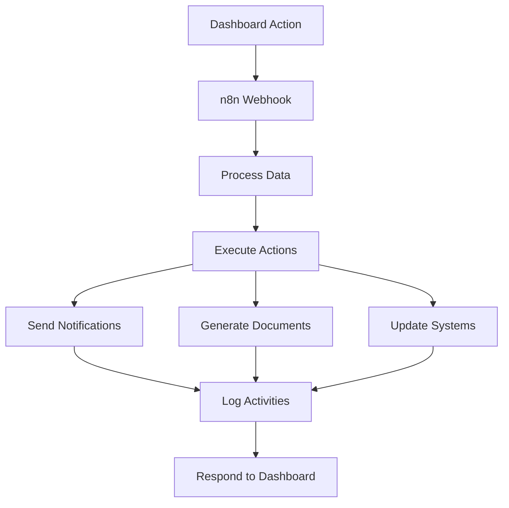

# 🎯 n8n Workflows for Ambica Pharma Chem Inventory System

This directory contains **4 comprehensive n8n workflows** that automate your entire inventory management process.

## 📁 Workflow Files

| File | Description | Webhook URL |
|------|-------------|-------------|
| `1-reorder-trigger-workflow.json` | **Automatic Reorder System** | `/webhook/reorder-trigger` |
| `2-purchase-order-processing.json` | **Purchase Order Processing** | `/webhook/send-purchase-order` |
| `3-multi-channel-notifications.json` | **Multi-Channel Alerts** | `/webhook/notify-manager` |
| `4-report-generation.json` | **Automated Report Generation** | `/webhook/generate-report` |

## 🔄 Workflow Overview

### 1. **Reorder Trigger Workflow**
**Triggers:** When chemicals fall below reorder threshold

**Actions:**
- ✅ Calculates recommended order quantity
- ✅ Sends email to supplier with PO request
- ✅ Notifies procurement team
- ✅ Sends Telegram alerts (critical vs standard)
- ✅ Logs all activities
- ✅ Responds to dashboard with status

**Channels:** Email, Telegram, Internal Notifications

---

### 2. **Purchase Order Processing**
**Triggers:** When PO needs to be sent to supplier

**Actions:**
- ✅ Generates professional PDF purchase order
- ✅ Emails PO to supplier with all details
- ✅ Notifies internal team of PO status
- ✅ Sends Slack/Telegram notifications
- ✅ Schedules 24-hour follow-up
- ✅ Logs PO generation and sending

**Features:** PDF generation, Email automation, Follow-up scheduling

---

### 3. **Multi-Channel Notifications**
**Triggers:** Any alert/notification from dashboard

**Actions:**
- ✅ Determines notification channels based on severity
- ✅ Sends **Email** with HTML formatting
- ✅ Posts to **Slack** with rich formatting
- ✅ Sends **Telegram** messages with buttons
- ✅ Delivers **WhatsApp** messages
- ✅ Sends **SMS** for critical alerts
- ✅ Logs all notification activities

**Channels:** Email, Slack, Telegram, WhatsApp, SMS

---

### 4. **Report Generation**
**Triggers:** Manual or scheduled report requests

**Actions:**
- ✅ Generates comprehensive HTML reports
- ✅ Converts to professional PDF
- ✅ Emails reports to management team
- ✅ Supports multiple report types:
  - Inventory Status Report
  - Purchase Orders Report  
  - Supplier Performance Report
  - Alert Summary Report
- ✅ Logs report generation activities

**Features:** PDF conversion, Email delivery, Multiple report types

---

## 🚀 Quick Setup

### Step 1: Import Workflows
1. Open n8n dashboard (http://localhost:5678)
2. Import each JSON file using the import function
3. Activate all workflows

### Step 2: Configure Credentials
Set up these credentials in n8n:
- **Email (SMTP)** - For sending emails
- **Telegram Bot** - For Telegram notifications
- **Slack** - For Slack integration
- **Twilio** - For SMS (optional)

### Step 3: Update Webhook URLs
In your dashboard `.env.local`:
```env
NEXT_PUBLIC_N8N_BASE_URL=http://localhost:5678
```

### Step 4: Test Integration
1. Open dashboard at http://localhost:3001
2. Go to Stock Management
3. Click "Trigger Reorder" on any item
4. Check n8n executions for results

## 🎛️ Customization

### Email Recipients
Update email addresses in each workflow:
- **Procurement Team**: `procurement@ambicapharma.com`
- **Management**: `manager1@ambicapharma.com, manager2@ambicapharma.com`
- **Warehouse**: `warehouse@ambicapharma.com`

### Supplier Information
In the **Reorder Trigger** workflow, update the `supplierContacts` object with real supplier details.

### Company Branding
In the **Purchase Order** workflow, customize:
- Company name and address
- Logo and branding
- Terms and conditions
- Contact information

### Notification Channels
Configure your preferred channels in the **Multi-Channel Notifications** workflow:
- Enable/disable specific channels
- Update chat IDs and webhook URLs
- Customize message formats

### Report Templates
In the **Report Generation** workflow:
- Modify HTML templates
- Add new report types
- Customize PDF styling
- Update recipient lists

## 🔧 Technical Details

### Webhook Security
All webhooks accept POST requests with JSON payloads. For production, consider adding:
- Webhook authentication tokens
- IP whitelisting
- Rate limiting

### Error Handling
Each workflow includes:
- Try-catch blocks for API calls
- Fallback actions for failed operations
- Detailed error logging
- Responsive error messages to dashboard

### Scalability
Workflows are designed to handle:
- Multiple concurrent requests
- Large datasets
- Various file formats
- Multiple notification channels simultaneously

## 📊 Monitoring

### Execution Logs
Monitor workflow performance in n8n:
- Go to **Executions** tab
- View success/failure rates
- Check execution times
- Debug failed runs

### Dashboard Integration
All workflows return structured responses to the dashboard:
```json
{
  "success": true,
  "message": "Operation completed successfully",
  "timestamp": "2024-01-15T10:30:00Z",
  "details": { ... }
}
```

## 🔗 Integration Flow



## 📞 Support

### Common Issues
1. **Webhook not responding** - Check n8n is running on port 5678
2. **Email not sending** - Verify SMTP credentials
3. **PDF generation failing** - Check PDF API configuration
4. **Notifications not working** - Verify bot tokens and chat IDs

### Testing Workflows
Use n8n's built-in testing feature:
1. Open workflow in n8n
2. Click "Execute Workflow"  
3. Provide test data
4. Check execution results

### Production Considerations
- Use environment variables for sensitive data
- Enable workflow logging
- Set up monitoring and alerting
- Implement backup and recovery procedures

---

## 🎉 Ready to Automate!

Your inventory system now has **full automation capabilities**:
- 🔄 **Automatic reordering** when stock is low
- 📄 **Automated PO generation** and supplier communication  
- 🔔 **Multi-channel notifications** for critical alerts
- 📊 **Scheduled report generation** and distribution

**Import these workflows and watch your inventory management become fully automated!** 🚀